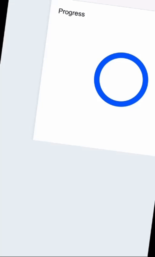

# Progress Indicator Project

## About

This repository contains a custom-built Progress Bar component designed for mobile web applications. The project was developed as part of a technical task and focuses on creating a reusable, state-driven UI component without relying on external libraries or frameworks.

## Project Overview

### Progress Indicator

The `Progress Indicator` project is a lightweight, flexible, and adaptive component for displaying the progress of various tasks. It is designed with mobile responsiveness in mind and offers a user-friendly interface to control its state.

#### Features

- **Value Control**: Allows users to adjust the progress value from 0 to 100, updating the visual representation accordingly.
- **Animated State**: Enables a rotation animation to visually indicate that a process is ongoing.
- **Hidden State**: Provides the ability to hide the progress indicator from view, useful for scenarios where progress tracking is temporarily unnecessary.
- **Responsive Design**: Adapts to both portrait and landscape orientations, ensuring a consistent user experience across different devices.

## How It Works

The component consists of the following key elements:

- **Progress Visual**: A circular progress bar where the length of the stroke represents the current progress value.
- **Controls**:
  - A numeric input for setting the progress value.
  - Two toggle switches: one for enabling/disabling animation and another for hiding the component.

### Implementation Details

#### HTML Structure

The HTML is structured to be semantic and accessible, with appropriate ARIA roles and labels to support users with assistive technologies.

#### CSS Styling

The styling is done with vanilla CSS, focusing on a clean and modern look. The component is also fully responsive, adjusting to different screen orientations using media queries.

#### JavaScript Functionality

The JavaScript handles the component's state changes, including updating the progress bar based on user input, toggling the animated state, and hiding/showing the component.

## Live Demo

Check out the live version of this project [here](https://jdoroshina.github.io/progress/).
